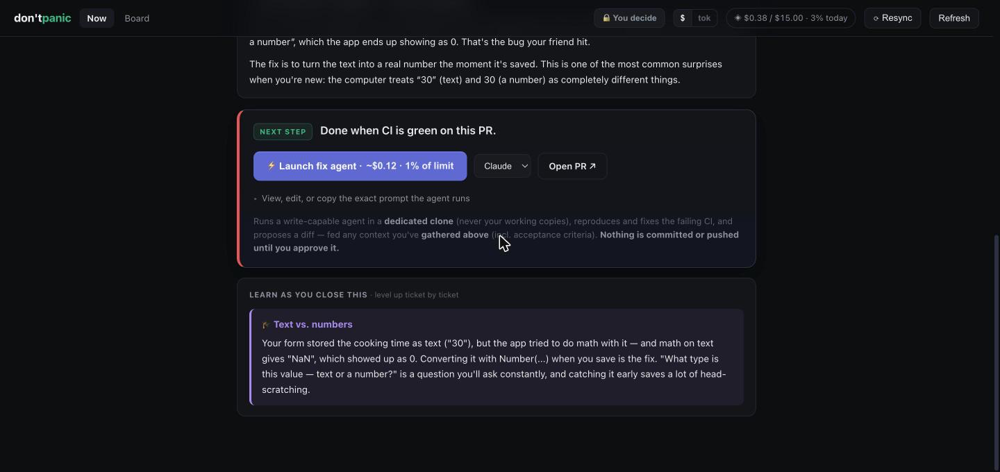

# dontpanic

**Fifteen years ago, the smart way into building software was fizzbuzz, data structures, and CS fundamentals. Today, the fastest way in is learning to work with agents.**

The on-ramp changed. If you're starting from zero, the highest-leverage skill isn't hand-writing algorithms — it's learning to **direct agents** to build what you want: giving them the **right context** and **supervising** their work. And if you already code, that's the new layer on top. dontpanic is a hands-on way to build that skill.

It teaches the loop that matters: gather the context an agent needs and **see what's missing**, watch how that context shapes the prompt, then **launch, monitor, and approve** an agent — reading its reasoning as it streams, deciding every write yourself.

**Today** it runs on your open pull requests (reviews you owe, fixes you need) — real work as the practice ground, so the skill transfers directly. **On the way:** a guided practice track (generic lessons for people starting from zero) and bring-your-own open-source agent, so you can learn even before you have a codebase or connectors of your own.

It has no API keys of its own. All the AI work runs through your **Claude Code CLI**, reusing *your* authenticated claude.ai connectors (Slack, Linear, Google Calendar) and GitHub via `gh`. GitHub data is free, and — because learning to **manage agent spend** is part of the skill — every token-spending action is a clearly-priced button shown against your daily limit. dontpanic never spends without you clicking.

---

> The screenshots below are from **demo mode** — a tiny, beginner-friendly example (building a recipe app with a friend). Everything you see is a real page; run it yourself with `dontpanic dashboard --demo` (no setup, no tokens).

## Screenshots

**The Board** — your practice queue: everything in your court, ranked by impact, each with a plain-language "why this one" so you learn to size up a task before spending anything:


**Now — managing context** — one task at a time: what it is in plain English, what's still undecided, and a timeline that keeps the current task centered:


**Learning as you go** — every task surfaces a small lesson grounded in the actual change (here: *text vs. numbers*), right next to the priced "launch the agent" button:



**Managing an agent** — launch it, watch its reasoning stream live, read the diff it proposes, then approve — nothing is pushed until you click:


**Supervising several at once** — the parallel grid, each agent working its own task with its own gated approve/push:


---

## Prerequisites

dontpanic drives tools you already have. Before it can do anything useful:

1. **Node ≥ 20**
2. **[GitHub CLI](https://cli.github.com/) (`gh`), authenticated** — `gh auth login`. All PR reads/writes go through it.
3. **[Claude Code CLI](https://docs.claude.com/en/docs/claude-code) (`claude`), signed in** — this is the agent dontpanic drives for reasoning, review, and fixes.
   - For the context/impact features, connect **Slack**, **Linear**, and **Google Calendar** in your Claude account. dontpanic reaches them *through* the `claude` CLI — no separate tokens.
4. **(optional) [Codex CLI](https://github.com/openai/codex) (`codex`)** — a second agent backend, offered in the UI only if installed.

Run `dontpanic doctor` any time to check all of the above.

---

## Quick start

```bash
# 1. First run: explains what it does, checks prerequisites, and sets up your repos
npx @jdamiba/dontpanic

# 2. Start the dashboard (fetches your PRs + optional calendar, then serves a local UI)
npx @jdamiba/dontpanic dashboard
# → open http://localhost:4711
```

Setup asks for your GitHub login, the repos to watch (`owner/name`, comma-separated), and — optionally — the Slack channels that carry incident/customer signal (to sharpen impact ranking).

---

## Commands

| Command | What it does |
|---|---|
| `dontpanic` | Welcome + prerequisite check + first-run setup |
| `dontpanic setup` | Set your GitHub login, repos, and signal channels |
| `dontpanic doctor` | Verify `claude` / `gh` / connectors are ready |
| `dontpanic dashboard` | Start the local dashboard (`--port`, `--no-sync`) |
| `dontpanic sync` | Refresh open PRs into the local store (GitHub only, free) |
| `dontpanic list` | Print PRs grouped by whose turn it is |

---

## The token model

- **GitHub data is free** — sync, the board, and whose-turn logic cost nothing.
- **AI work costs tokens** — impact ranking, per-PR briefs, full context, and the review/fix agents. Each is a **clearly-priced button**, and dontpanic **never spends without your click**.
- Every button shows its cost **and** what fraction of your **daily limit** it represents; toggle the header between dollars and tokens.
- Results are **cached**, so re-viewing costs nothing; only a changed PR re-bills.
- Writes to GitHub (submit a review, push a fix) and Slack (notify a colleague) are always **two-click, human-gated** — even in the parallel/burndown flows.

Set your daily caps and per-job models in `~/.dontpanic/config.json` (`budget`, `models`). Existing `~/.prclear` installs keep working; override the location with `DONTPANIC_HOME`.

---

## What it teaches (and the feature that teaches it)

**Managing context** — the input side of agentic work:
- **Now** — a single-task cockpit that makes you gather the context an agent needs, **flags what's still missing**, and shows how it all feeds the prompt (there's a "view the exact prompt the agent runs" panel).
- **Board** — reads a per-PR brief (state + what the change needs) so you learn to size up a task before spending anything.

**Managing agents** — the supervision side:
- **Launch → monitor → approve** — deploy a review or fix agent, watch its reasoning **stream live**, then approve (or reject) every GitHub write yourself. Pick the model/backend (Claude or Codex) for the job.
- **Parallel** — practice supervising *several* agents at once, each with its own gated approve/push.
- **Burndown** — supervise an agent working down the whole court, one task at a time.
- **Spend as a first-class signal** — every action is priced against a daily limit, so managing an agent's cost becomes a habit, not an afterthought.

**Coaching** — each task surfaces a CS / systems / process lesson grounded in the actual diff, so you level up on the fundamentals as you go (toggle off in config).

---

## Customize the AI to your team

dontpanic's defaults are opinions, and you can override them without touching code — drop optional markdown files in your config dir (`~/.dontpanic/`), like a `CLAUDE.md` for your PR workflow:

| File | Shapes | Example |
|---|---|---|
| `prioritization.md` | How PRs are ranked ("what to do first") | *"Rank by: 1) customer SLA breaches, 2) PRs blocking a teammate, 3) security. Deprioritize refactors."* |
| `review-guidelines.md` | House rules the review + fix agents apply | *"- Use Conventional Commits. - Flag any new N+1 query. - Require a test for every bugfix."* |

If a file is absent, the built-in default is used. `dontpanic doctor` shows which are active, and the "view the exact prompt" panel in the UI reflects them.

Structured settings live in `~/.dontpanic/config.json`:

| Key | What it controls |
|---|---|
| `repos`, `me` | Which repos to watch, and your GitHub login |
| `signalChannels` | Slack channels searched for incident/customer signal |
| `budget` | Daily $ and token caps shown in the UI |
| `models` | Per-job model (`enrich`, `prioritize`, `brief`, `meeting`, `ping`) |
| `defaultAgent` | `claude` or `codex` for review/fix (picker overrides per-launch) |
| `autoSpend` | Auto-run the reasoning reads vs. click every spend |
| `workday` | `{ "start": "09:00", "focusHours": 8 }` — the day timeline |
| `turnOrder` | Order your court is worked, e.g. own-CI-first vs. reviews-first (a permutation of the 5 turns; invalid → default) |
| `coaching` | `true`/`false` — show the "learn as you close this" element |
| `repoTypes` | Per-repo change-type hint for non-JS/Python stacks, e.g. `{ "me/api": "backend" }` |

## License

MIT © Joseph Damiba
